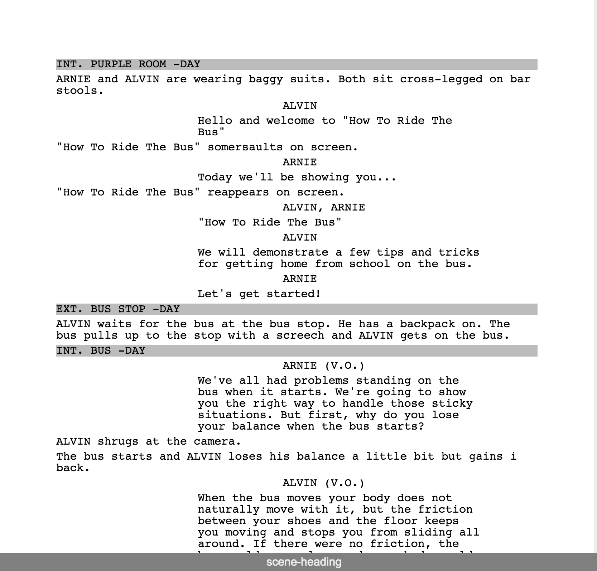

#Ribbon

Ribbon is a free solution to the lack of quality screenwriting applications. It's goal is to be simple and easy to use without a clunky interface. If you want the latest build of Ribbon go [here](http://blockaj.github.io/Ribbon).
##Table of Contents 
*   [Intro](#Ribbon)
*   [Features](#features)
*   [Contributing](#contributing)
*   [Changelog](#changelog)

##Features
*   Format text like screenplay
    *   Format character, scene headings, dialogue, etc. 
    *   Add page numbers
*   Export to pdf 
*   Print
*   Version control

##Contributing
Ribbon is a very new project. If you'd like to contribute I recommend downloading the latest build and reporting issues. Once more issues are reported, there will be more to contribute. 

##Changelog
###[0.1.0] -2015-05-14
####Added
- Basic screenplay formatting, excluding title page, page numbers
- Export to PDF 

